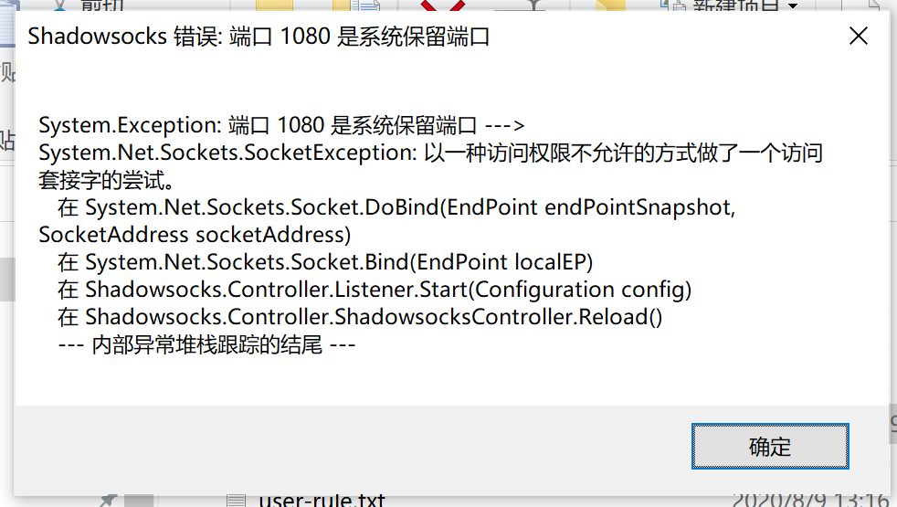
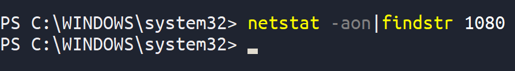
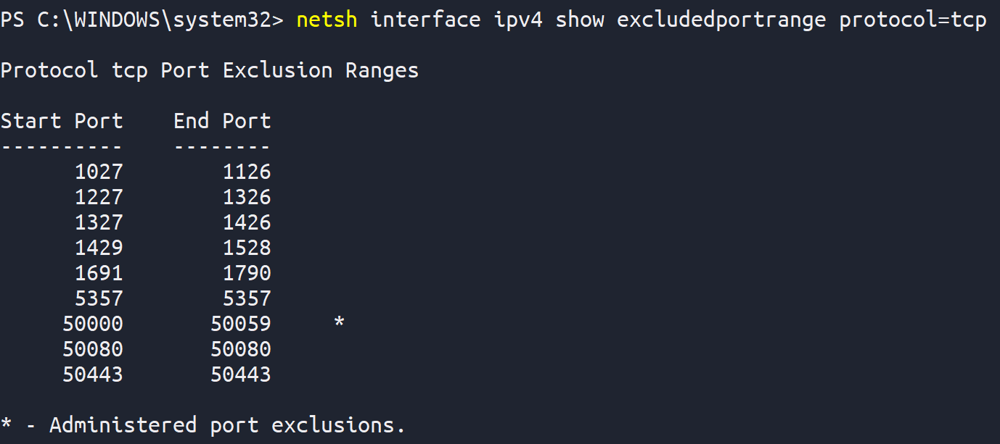
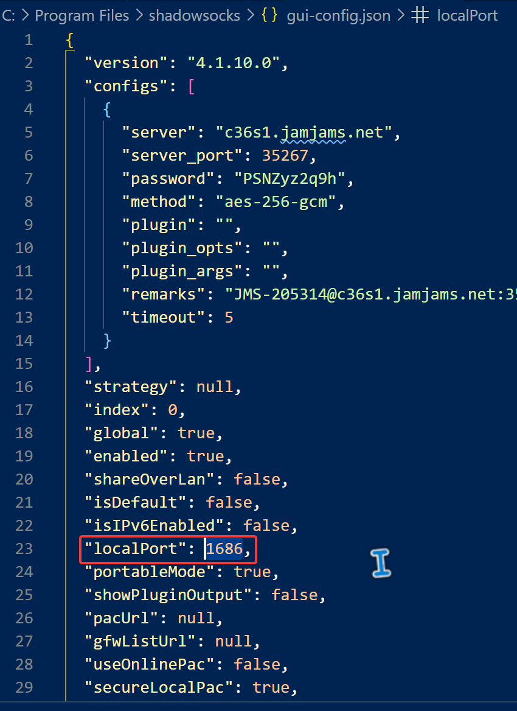

# 问题发现

小飞机用的好好的,突然有一天弹出一个错误信息



一开始我认为是1080端口被占用了,可能是残留的小飞机进程占用着1080端口

打开Powershell,查看端口占用,并搜索1080

```netstat -aon|findstr “1080”```

但是,并没有


查看系统保留端口发现

```netsh interface ipv4 show excludedportrange protocol=tcp```



果然1080是被保留的

# 问题解决

打开小飞机的配置文件

```gui-config.json```

更换一个保留端口之外的新端口



小飞机又起飞啦~~